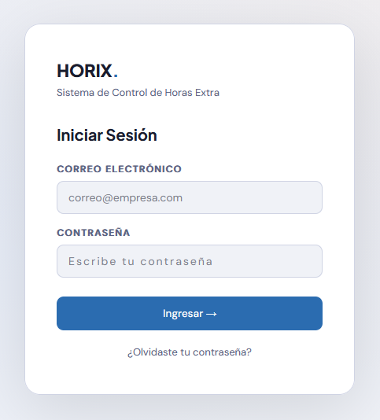
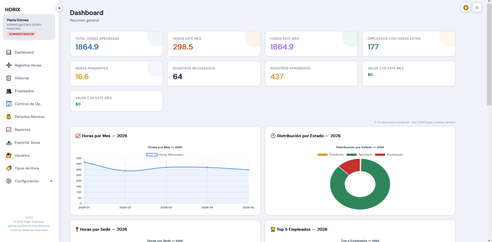
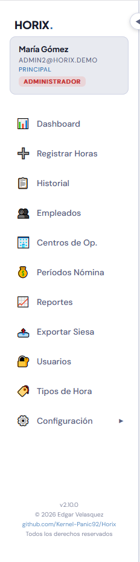
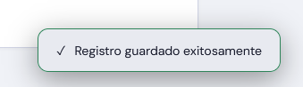
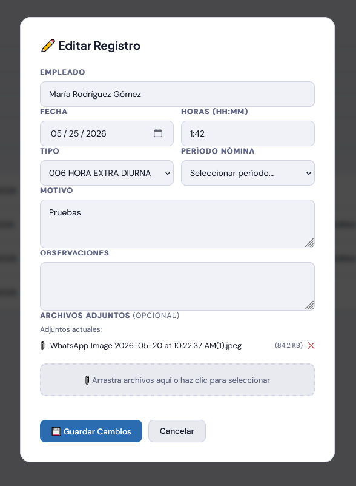
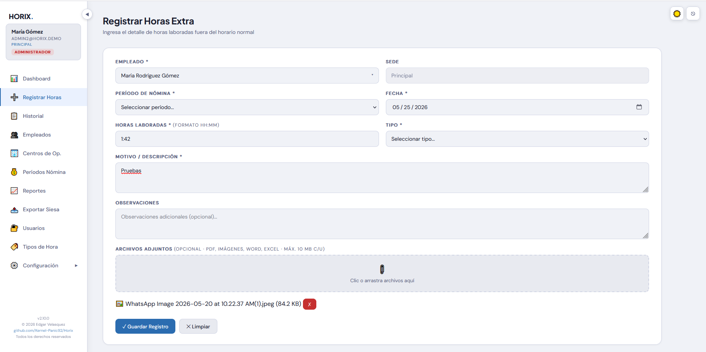
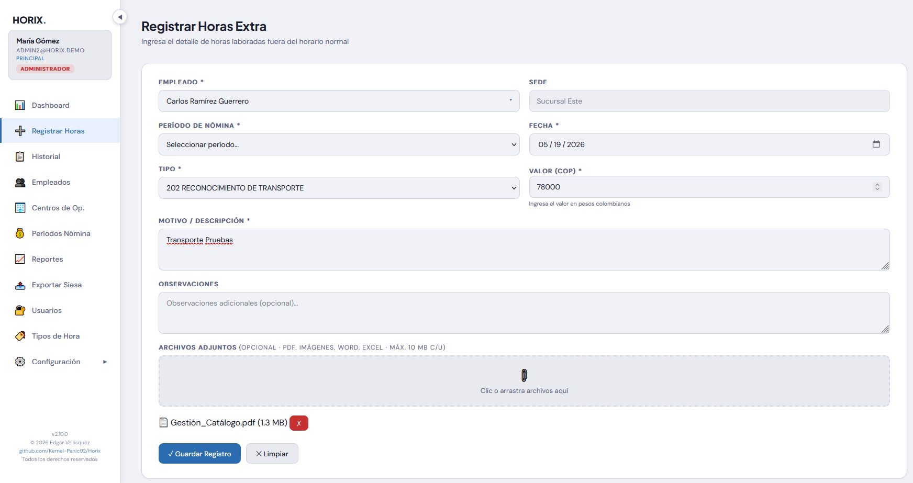
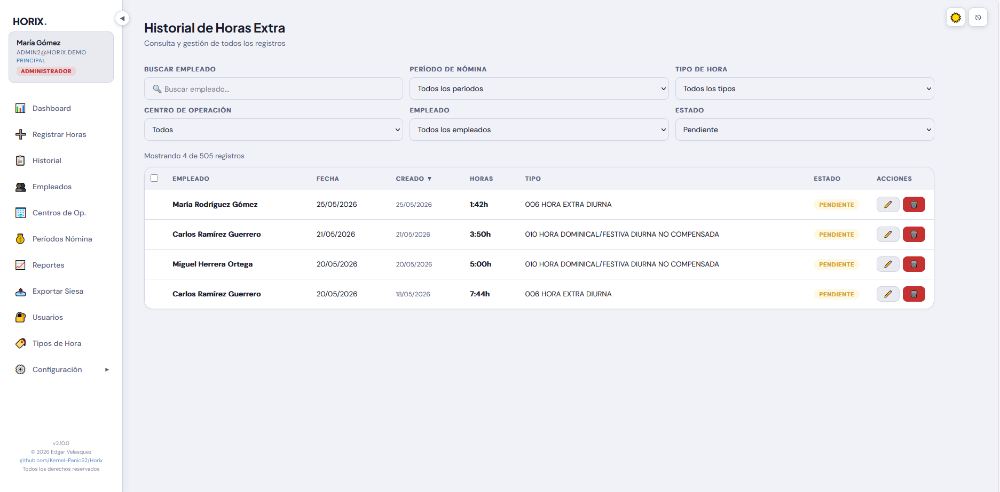
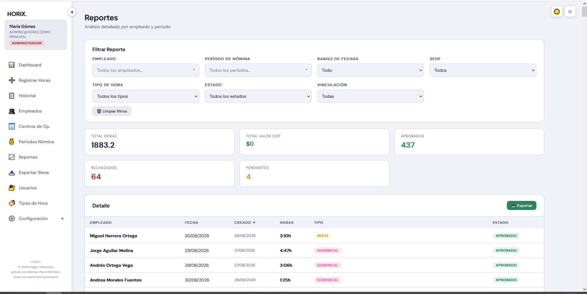
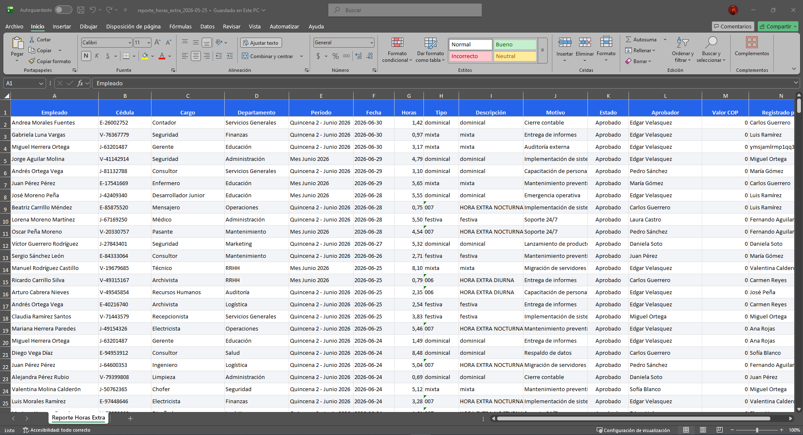

# Manual de Gerencia — Horix

> Sistema de Gestión de Horas Extras y Novedades de Nómina

---

## 1. Inicio de Sesión

1. Abre el navegador y ve a la URL de Horix
2. Ingresa tu **correo electrónico** y **contraseña** asignados por RRHH
3. Haz clic en **"Iniciar Sesión"**

> Si olvidaste tu contraseña, haz clic en "¿Olvidaste tu contraseña?" para solicitar un restablecimiento.

---

## 2. Conociendo el Dashboard

Al ingresar, verás el **Dashboard** con un resumen visual:

### Widgets disponibles:

| Widget | Descripción |
|---|---|
| **Distribución por Estado** | Gráfico circular con el porcentaje de registros aprobados, pendientes y rechazados |
| **Horas por Centro** | Horas acumuladas por cada sede en el año actual |
| **Top 5 Empleados** | Los 5 empleados con más horas registradas en el año |
| **Últimos Registros** | Lista de los registros más recientes de todos los empleados |
| **Valor COP por Mes** | Distribución mensual del valor monetario en el año |

> A diferencia del operador, ves información consolidada de **todas las sedes** y todos los empleados.

---

## 3. Barra Lateral de Navegación

A la izquierda encontrarás el menú principal:

### Opciones disponibles para Gerencia:

| Ícono | Sección | Descripción |
|---|---|---|
| 📊 | **Dashboard** | Panel de inicio con resumen |
| 📝 | **Historial** | Consulta todos los registros de la organización |
| ➕ | **Nuevo Registro** | Formulario para cargar horas extras o novedades |
| 📈 | **Reportes** | Exportar y filtrar registros |

> Si el menú se ve muy pequeño, usa el botón ≡ para colapsarlo o ☰ en móvil.

---

## 4. Aprobar o Rechazar Registros

Esta es tu función principal como Gerencia. Eres el único rol con capacidad de aprobar o rechazar registros.

### 4.1 Aprobación o Rechazo Individual

Cada registro Pendiente en el Historial tiene botones **✓ Aprobar** y **✗ Rechazar** en la columna Acciones:

#### Para aprobar un registro:

1. Ve al **Historial**
2. Busca el registro con estado **Pendiente**
3. Haz clic en el botón **✓ Aprobar** (verde)
4. Se abrirá un modal de confirmación:
   - Puedes escribir un **motivo de aprobación** (opcional)
5. Haz clic en **"Aprobar"**

#### Para rechazar un registro:

1. Ve al **Historial**
2. Busca el registro con estado **Pendiente**
3. Haz clic en el botón **✗ Rechazar** (rojo)
4. Se abrirá un modal de confirmación con un campo de texto:
   - Ingresa el **motivo de rechazo** (opcional pero recomendado)
5. Haz clic en **"Rechazar"**

> El motivo de aprobación o rechazo queda registrado en el historial del registro y es visible para el operador que lo creó.

### 4.2 Aprobación o Rechazo Masivo

Cuando necesitas procesar varios registros a la vez, usa la selección múltiple:

1. Ve al **Historial**
2. Marca el **checkbox** en la primera columna de cada registro Pendiente que quieras procesar
3. Aparecerá una **barra de acciones** en la parte superior de la tabla mostrando la cantidad de seleccionados
4. Haz clic en **"✓ Aprobar"** o **"✗ Rechazar"** en la barra
5. Confirma la acción en el cuadro de diálogo

**Consejos:**

| Acción | Cómo hacerlo |
|---|---|
| Seleccionar todos | Usa el checkbox en el encabezado de la tabla |
| Deseleccionar uno | Haz clic en su checkbox individual |
| Seleccionar varios | Marca los checkbox uno por uno |
| La barra desaparece | Al deseleccionar todos o al recargar la página |

### 4.3 Aprobación desde el Detalle

También puedes aprobar o rechazar desde el modal de detalle:

1. Haz clic en cualquier fila del Historial para abrir el **detalle del registro**
2. En la parte inferior del modal verás los botones **✓ Aprobar** y **✗ Rechazar**
3. Haz clic en el que corresponda
4. Confirma en el modal de confirmación

> Una vez aprobado o rechazado, el registro no podrá editarse. Si cometiste un error, puedes **revertir** la acción (ver sección 6).

---

## 5. Revisar Detalle del Registro

Haz clic en cualquier fila del Historial para ver el detalle completo:

### Información disponible:

- **Empleado** y cédula
- **Sede** y departamento
- **Período de nómina**
- **Fecha** del registro
- **Tipo** de hora (o valor COP)
- **Horas** o **Valor COP** según corresponda
- **Motivo** y **observaciones**
- **Adjuntos** si aplica
- **Quién lo creó** y **cuándo**
- **Estado** actual y quién lo aprobó/rechazó

---

## 6. Editar y Revertir Registros

### Editar:

Puedes editar **cualquier registro Pendiente**, sin importar quién lo creó:

1. Ve al **Historial**
2. Localiza el registro en estado Pendiente
3. Haz clic en **✏️ Editar**
4. Modifica los campos necesarios
5. Haz clic en **"Guardar Cambios"**

### Revertir:

Si apruebas o rechazas un registro por error, puedes **revertir** la acción:

1. Ve al **Historial**
2. Localiza el registro (estado Aprobado o Rechazado)
3. Haz clic en **↩️ Revertir**
4. El registro volverá a estado **Pendiente**

> Al revertir, se elimina la información de quién aprobó/rechazó. El registro queda nuevamente Pendiente para su revisión.

---

## 7. Crear un Nuevo Registro

También puedes crear registros directamente, por ejemplo si un operador no tiene acceso o necesitas hacer un ajuste:

1. Haz clic en **"Nuevo Registro"** en el menú lateral
2. **Empleado** — empieza a escribir su nombre y elige de la lista
3. **Período de Nómina** — selecciona el período correspondiente
4. **Fecha** — escoge la fecha del registro
5. **Horas** — ingresa en formato `HH:MM` (ej: `1:30`) o **Valor COP** si el tipo lo requiere
6. **Tipo** — selecciona el tipo de hora
7. **Motivo** — describe la actividad (campo obligatorio)
8. **Observaciones** — opcional
9. **Adjuntos** — arrastra archivos si aplica
10. Haz clic en **"Guardar Registro"**

### Tipos Valor COP:

Si el tipo seleccionado es de **Valor COP**:
- El campo **Horas** se oculta automáticamente
- Aparece el campo **Valor COP** para ingresar el monto en pesos

> No puedes crear registros con fecha futura ni fuera del período de nómina.

---

## 8. Historial — Visión Completa

El Historial te muestra **todos los registros de la organización**, no solo los tuyos:

### Filtros disponibles:

| Filtro | Descripción |
|---|---|
| **Buscar Empleado** | Por nombre |
| **Período de Nómina** | Período específico |
| **Tipo de Hora** | Por tipo |
| **Centro de Operación** | Por sede |
| **Empleado** | Selección específica |
| **Estado** | Pendiente, Aprobado o Rechazado |

Ordena la tabla haciendo clic en los encabezados.

### Acciones por registro:

| Botón | Acción |
|---|---|
| ✓ | **Aprobar** — solo si está Pendiente |
| ✗ | **Rechazar** — solo si está Pendiente |
| ✏️ | **Editar** — solo si está Pendiente |
| ↩️ | **Revertir** — si está Aprobado o Rechazado |
| 👁️ | **Ver detalle** — haz clic en la fila |

> La tabla se actualiza automáticamente cada 30 segundos.

---

## 9. Reportes

Filtros adicionales: **Rango de Fechas** y **Vinculación**.

### Exportar a Excel:

1. Aplica los filtros deseados
2. Haz clic en **"📥 Exportar"**
3. Se descarga un `.xlsx` con formato profesional

---

## 10. Cerrar Sesión

Haz clic en **⎋** (barra superior derecha) y confirma.

> La sesión expira automáticamente tras 30 días de inactividad.

---

## 11. Solución de Problemas

| Problema | Solución |
|---|---|
| No veo botón de Aprobar/Rechazar | Asegúrate de haber iniciado sesión con tu cuenta de Gerencia |
| No aparece la barra de aprobación masiva | Marca al menos un checkbox en un registro Pendiente |
| No aparecen los checkboxes | Solo se muestran en registros con estado Pendiente |
| No aparece el registro que busco | Usa los filtros o verifica el período de nómina |
| "No tienes permisos" | Tu cuenta puede no tener el rol de gerencia. Contacta al administrador |
| No puedo editar un registro | Solo se pueden editar registros en estado Pendiente |
| Revertí por error y quiero volver | Vuelve a aprobar o rechazar. El registro queda Pendiente |
| Historial desactualizado | Espera hasta 30 segundos (auto-refresh) |
| Valor COP no aparece | Selecciona un tipo marcado como "Tipo valor" |
| Fecha incorrecta | No se permiten fechas futuras ni fuera del período |

---

## Resumen de Permisos

| Acción | ¿Puede? |
|---|---|
| Ver Dashboard (datos consolidados) | ✅ |
| Ver Historial (todos los registros) | ✅ |
| Crear registros | ✅ |
| Editar cualquier registro (pendiente) | ✅ |
| Aprobar/Rechazar registros | ✅ |
| Revertir aprobaciones/rechazos | ✅ |
| Ver Reportes | ✅ |
| Exportar Excel | ✅ |
| Gestionar empleados/usuarios | ❌ |
| Gestionar tipos/centros/nóminas | ❌ |
| Configuración/Backup | ❌ |

---

*Documento generado para Horix v2.10.0*
© 2026 Edgar Velasquez
github.com/Kernel-Panic92/Horix
Todos los derechos reservados
