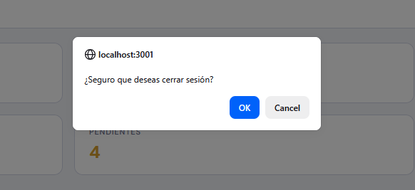

# Manual de Administración — SynnoxERP

> Sistema de Gestión de Horas Extras y Novedades de Nómina

---

## 1. Inicio de Sesión

1. Abre el navegador y ve a la URL del sistema
2. Ingresa tu **correo electrónico** y **contraseña** de administrador
3. Haz clic en **"Iniciar Sesión"**

> Si olvidaste tu contraseña, usa "¿Olvidaste tu contraseña?" para solicitar un restablecimiento. Si eres el admin principal y no puedes acceder, restaura desde backup o contacta al soporte técnico.

---

## 2. Conociendo el Dashboard

Al ingresar, verás el **Dashboard** con datos consolidados de toda la organización:

### Widgets disponibles:

| Widget | Descripción |
|---|---|
| **Distribución por Estado** | Gráfico circular con todos los registros de la empresa |
| **Horas por Centro** | Horas acumuladas por cada sede |
| **Top 5 Empleados** | Empleados con más horas registradas |
| **Últimos Registros** | Registros más recientes de todos los empleados |
| **Valor COP por Mes** | Distribución mensual del valor monetario en el año |

> Como administrador, ves **todos los datos** de todas las sedes y empleados sin restricciones.

---

## 3. Barra Lateral de Navegación

A la izquierda encontrarás el menú principal con **todas las opciones** del sistema:

### Opciones completas:

| Ícono | Sección | Descripción |
|---|---|---|
| 📊 | **Dashboard** | Panel de inicio con resumen |
| ➕ | **Registrar Horas** | Formulario para cargar horas extras |
| 📋 | **Historial** | Todos los registros de la organización |
| 👥 | **Empleados** | Gestión de empleados |
| 🏢 | **Centros de Op.** | Gestión de centros de operación |
| 💰 | **Períodos Nómina** | Gestión de períodos de nómina |
| 📈 | **Reportes** | Exportar y filtrar registros |
| 📤 | **Exportar Siesa** | Exportación para Siesa Nómina Web |
| 🔐 | **Usuarios** | Gestión de usuarios del sistema |
| 🏷️ | **Tipos de Hora** | Gestión de tipos de hora extra |
| ⚙️ | **Configuración** | Submenú con opciones avanzadas |
| ↳ 📧 | Config. Correo | Configuración SMTP |
| ↳ 💾 | Backup | Respaldo y restauración |
| ↳ 🛡️ | Seguridad | Rate limiting y bloqueos |
| ↳ 📋 | Auditoría | Sesiones e inicios de sesión |
| ↳ 🔬 | Diagnóstico | Telemetría de uso y errores |

> Si el menú se ve muy pequeño, usa el botón ≡ para colapsarlo o ☰ en móvil.

---

## 4. Gestión de Usuarios

Esta sección te permite crear y administrar las cuentas de todos los usuarios del sistema.

### Crear un usuario:

1. Ve a **Usuarios** en el menú lateral
2. Haz clic en **"Nuevo Usuario"**
3. Completa los campos:
   - **Nombre** completo
   - **Correo electrónico** (será su usuario de inicio de sesión)
   - **Rol**: Admin, RRHH, Gerencia, Operador o Consulta
   - **Sede** asignada (solo aplica para RRHH/Operador)
4. Haz clic en **"Guardar"**
5. El sistema enviará un correo de recuperación al usuario para que establezca su contraseña

### Roles disponibles:

| Rol | Permisos principales |
|---|---|
| **Admin** | Acceso total a todas las funciones |
| **RRHH** | Gestión de empleados, usuarios, nóminas, registros, tipos, reportes, Siesa |
| **Gerencia** | Ver todos los registros, aprobar/rechazar, reportes |
| **Operador** | Crear y ver sus propios registros, reportes |
| **Consulta** | Solo ver reportes |

### Asignación de empleados:

Puedes restringir qué empleados puede ver un usuario (especialmente útil para RRHH y Operador):

1. En la lista de usuarios, haz clic en **✏️ Editar**
2. En la sección **"Empleados autorizados"**, selecciona los empleados
3. Usa **"Seleccionar todos"** o **"Ninguno"** para agilizar
4. Si no seleccionas ninguno, el usuario verá **todos** los empleados de su sede

### Resetear contraseña:

1. Haz clic en el usuario
2. Selecciona **"Resetear contraseña"**
3. El sistema enviará un correo de recuperación

> Un usuario inactivo no puede iniciar sesión, pero sus registros históricos se conservan.

---

## 5. Gestión de Empleados

Aquí se administra la base de datos de empleados de la organización.

### Campos del empleado:

| Campo | Descripción |
|---|---|
| **Nombre** | Nombre completo |
| **Cédula** | Número de identificación (único) |
| **Cargo** | Cargo del empleado |
| **Departamento** | Departamento al que pertenece |
| **Email** | Correo electrónico (opcional) |
| **Teléfono** | Número de contacto (opcional) |
| **Vinculación** | Vinculado o Temporal |
| **Sede** | Centro de operación asignado |

### Importación masiva por CSV:

1. Ve a **Empleados** y haz clic en **"Importar CSV"**
2. Arrastra un archivo `.csv` con las columnas:
   - `nombre` (requerido)
   - `cedula` (requerido, único)
   - `cargo`, `departamento`, `sede` (requeridos)
   - `email`, `telefono` (opcionales)
3. Usa una fila por empleado
4. El sistema **omite duplicados** automáticamente (por cédula)

### Limpiar datos corruptos:

Si ves un banner de advertencia **"⚠️ Empleados con datos corruptos"** al entrar a Empleados, significa que hay registros con caracteres extraños (�) por problemas de codificación al importar.

1. Haz clic en **"Mostrar afectados"** para filtrar solo esos empleados
2. Edita cada uno y corrige el nombre manualmente
3. Guarda los cambios

> La importación CSV omite automáticamente empleados duplicados por cédula, pero no valida codificación de caracteres.

---

## 6. Centros de Operación (Sedees)

Gestiona las sedes o centros de operación de la empresa.

1. Ve a **Centros de Op.**
2. Haz clic en **"Nuevo Centro"**
3. Ingresa el **nombre** del centro
4. Opcionalmente puedes **desactivar** un centro en lugar de eliminarlo
5. Al eliminar, el sistema verifica que no tenga empleados asignados

> Si un centro tiene empleados, no podrás eliminarlo. Desactívalo en su lugar.

---

## 7. Períodos de Nómina

Gestiona los períodos de nómina del sistema.

### Crear un período manualmente:

1. Ve a **Períodos Nómina**
2. Haz clic en **"Nuevo Período"**
3. Ingresa nombre, tipo (Quincenal/Mensual), rango de fechas
4. Guarda

### Generación automática anual:

1. Haz clic en **"Generar Año"**
2. Selecciona el **tipo**: Quincenal (24 períodos) o Mensual (12 períodos)
3. Revisa el **preview** antes de confirmar
4. Confirma la generación

### Visualización:

- Los períodos se agrupan por año
- Cada período muestra: nombre, tipo, fechas, cantidad de registros y total de horas
- Haz clic en el año para expandir/colapsar

> Solo el administrador puede eliminar períodos de nómina.

---

## 8. Tipos de Hora

Define los tipos de hora extra o concepto de nómina disponibles.

### Crear un tipo:

1. Ve a **Tipos de Hora**
2. Haz clic en **"Nuevo Tipo"**
3. Ingresa:
   - **Nombre**: identificador único
   - **Valor COP**: marca esta opción si el concepto es monetario (transporte, bonificaciones, auxilios) en vez de horas
4. Guarda

### Activar/Desactivar:

- Los tipos **inactivos** no aparecen en el formulario de registro
- Los registros existentes con tipos inactivos no se ven afectados

> Si marcas "Valor COP", el campo Horas se oculta automáticamente y aparece Valor COP en el formulario de registro.

---

## 9. Exportar Siesa

Exporta las novedades de horas extra aprobadas para Siesa Nómina Web.

1. Ve a **Exportar Siesa**
2. Selecciona **rango de fechas** (desde/hasta)
3. Opcionalmente filtra por **concepto** (código Siesa)
4. Revisa la **vista previa** con los registros a exportar
5. Haz clic en **"Exportar"**
6. Se descarga un `.xlsx` listo para importar en Siesa

> Solo se exportan registros con estado **Aprobado**. Los pendientes o rechazados no se incluyen.

---

## 10. Historial

Como administrador, ves **todos los registros** de la organización.

### Acciones disponibles para Admin (además de las estándar):

| Botón | Acción |
|---|---|
| 🗑️ | **Eliminar** — elimina permanentemente un registro |
| ✏️ | **Editar** — cualquier registro pendiente |
| 👁️ | **Ver detalle** |

> El historial se actualiza automáticamente cada 30 segundos. Usa los filtros para encontrar registros específicos.

---

## 11. Reportes

Exporta registros filtrados a Excel con formato profesional.

Filtros: empleado, período, tipo, centro, estado, rango de fechas, vinculación.

1. Aplica los filtros deseados
2. Haz clic en **"📥 Exportar"**
3. Se descarga un `.xlsx` con estilo (encabezados azules, bordes, formato de moneda)

---

## 12. Configuración SMTP

Configura el servidor de correo para el envío de notificaciones y recuperación de contraseñas.

### Campos:

| Campo | Descripción |
|---|---|
| **Host** | Servidor SMTP (ej: smtp.gmail.com) |
| **Puerto** | 587 (TLS) o 465 (SSL) |
| **TLS** | Marcar si requiere conexión segura |
| **Usuario** | Cuenta de correo |
| **Contraseña** | Contraseña o token de aplicación |
| **Remitente** | Dirección de respuesta |

### Probar envío:

1. Completa la configuración
2. Haz clic en **"Enviar Prueba"**
3. Revisa la bandeja de entrada del admin actual

### Plantilla de correo:

Puedes personalizar el asunto y cuerpo HTML del correo de recuperación de contraseña. Usa las variables:
- `{nombre}` — nombre del usuario
- `{enlace}` — enlace de recuperación

> Gmail requiere un **token de aplicación** (no la contraseña normal). Actívalo en: Seguridad → Verificación en dos pasos → Contraseñas de aplicación.

---

## 13. Backup

Respalda y restaura la información completa del sistema.

### Descargar backup:

1. Ve a **Configuración → Backup**
2. Haz clic en **"Descargar Backup"**
3. Obtienes un archivo `.zip` con `backup.json` y CSVs de cada tabla

### Restaurar desde archivo:

1. Arrastra un archivo `.zip` o `.json` al área designada
2. Confirma la restauración
3. El sistema reemplaza los datos actuales (excepto tu sesión)

### Backups automáticos del servidor:

- El servidor genera backups automáticos periódicamente
- Puedes ver la lista con fecha, tamaño y estado
- Descarga o restaura directamente desde la lista

> La restauración reemplaza TODOS los datos. Asegúrate de tener un backup actual antes de restaurar.

---

## 14. Seguridad (Rate Limiting)

Monitorea y gestiona la protección contra ataques de fuerza bruta.

### Dashboard de seguridad:

| Tarjeta | Descripción |
|---|---|
| **IPs Bloqueadas** | Direcciones bloqueadas temporalmente |
| **IPs en Seguimiento** | Direcciones con intentos fallidos recientes |

### Configuración actual:

- **Intentos máximos**: antes del bloqueo
- **Ventana de tiempo**: período para contar intentos
- **Duración del bloqueo**: tiempo que permanece bloqueada

### Desbloquear IP:

1. Busca la IP en la lista de bloqueadas
2. Haz clic en **"Desbloquear"**
3. La IP puede volver a intentar login inmediatamente

---

## 15. Auditoría

Monitorea las sesiones activas y el historial de inicios de sesión.

### Sesiones activas:

Lista de usuarios con sesión abierta, mostrando:
- Nombre, rol, email
- IP y navegador
- Último login y expiración
- Puedes **cerrar sesión remotamente** de cualquier usuario

### Historial de inicios:

- Inicios exitosos y fallidos
- Filtros por usuario, tipo (exitoso/fallido), rango de fechas

### Stats del día:

- Sesiones activas totales
- Inicios exitosos hoy
- Intentos fallidos hoy

---

## 16. Diagnóstico (Telemetría)

Visualiza estadísticas de uso del sistema y errores reportados por los usuarios.

### Secciones:

| Sección | Descripción |
|---|---|
| **Totales** | Conteo de eventos por tipo (page views, exportaciones, etc.) |
| **Páginas más visitadas** | Top de páginas en los últimos 30 días (gráfico de barras) |
| **Errores JS** | Errores más frecuentes en el frontend (últimos 30 días), con módulo y línea |
| **Eventos recientes** | Últimos 50 eventos registrados con fecha, evento, página y usuario |

> Esta información ayuda a detectar problemas de usabilidad o errores técnicos reportados por los usuarios.

---

## 17. Cerrar Sesión

Haz clic en **⎋** en el sidebar (parte inferior) y confirma.

> La sesión expira automáticamente tras 30 días de inactividad.

---

## 18. Solución de Problemas

| Problema | Solución |
|---|---|
| No puedo iniciar sesión como admin | Usa "Olvidaste tu contraseña" o restaura desde backup |
| Usuario no recibe correo de recuperación | Verifica configuración SMTP en Config. Correo y haz una prueba |
| Empleados con caracteres extraños (�) | Usa "Limpiar corruptos" en Empleados y edita uno por uno |
| Error al importar CSV | Verifica que las columnas sean: nombre, cedula, cargo, departamento, sede |
| Backup no se descarga | Revisa el espacio en disco del servidor |
| IP bloqueada por error | Ve a Seguridad y desbloquéala manualmente |
| No aparecen datos en Dashboard | Verifica que haya registros creados y aprobados |
| Error de permisos en alguna función | Solo el admin tiene acceso completo. Los demás roles tienen restricciones |

---

## Resumen de Permisos

| Acción | ¿Puede? |
|---|---|
| Ver Dashboard (datos consolidados) | ✅ |
| Ver Historial (todos los registros) | ✅ |
| Crear registros | ✅ |
| Editar cualquier registro (pendiente) | ✅ |
| Eliminar registros | ✅ |
| Gestionar usuarios (CRUD + reset pass) | ✅ |
| Gestionar empleados (CRUD + importar CSV) | ✅ |
| Gestionar centros de operación | ✅ |
| Gestionar períodos de nómina | ✅ |
| Generar períodos automáticos | ✅ |
| Gestionar tipos de hora | ✅ |
| Exportar Siesa | ✅ |
| Configurar SMTP | ✅ |
| Backup y restauración | ✅ |
| Gestionar seguridad (rate limiting) | ✅ |
| Auditoría (sesiones e inicios) | ✅ |
| Diagnóstico (telemetría y errores) | ✅ |
| Aprobar/Rechazar registros | ❌ (solo Gerencia) |

> Nota: Aunque el Admin tiene acceso a todo el sistema, la **aprobación de registros** está reservada exclusivamente para el rol de **Gerencia**. Como admin puedes editar, eliminar o revertir registros, pero no aprobarlos.

---

*Documento generado para SynnoxERP v2.10.0*
© 2026 Edgar Velasquez
github.com/Kernel-Panic92/synnox-erp
Todos los derechos reservados
